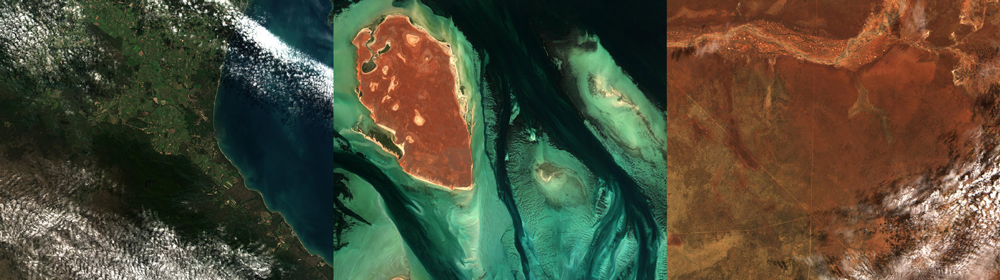
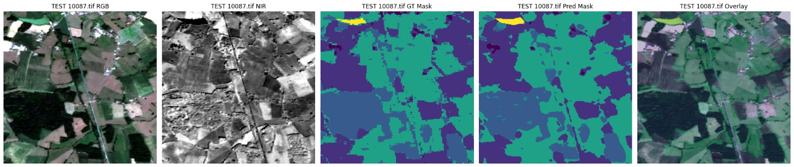
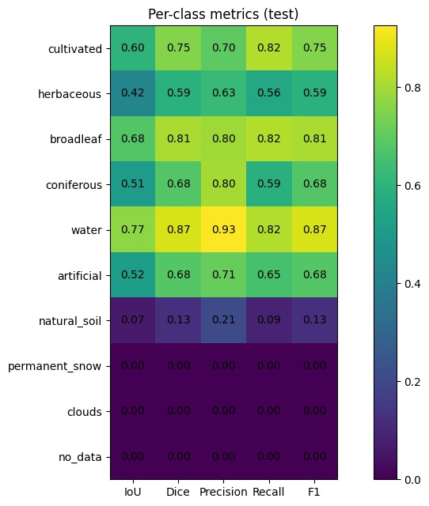

# U-Net Satellite Segmentation

A complete PyTorch implementation of U-Net for **10-class semantic segmentation** of multispectral satellite imagery. This project includes training pipeline, comprehensive metrics, and visualization tools for Earth observation and land cover classification tasks.



## Overview

This project provides:
- **U-Net Architecture**: Fully convolutional encoder-decoder network with skip connections
- **Multispectral Support**: 4-band imagery (Blue, Green, Red, NIR)
- **10-class Segmentation**: Land cover classification from satellite data
- **Complete Training Pipeline**: Data loading, training, validation, checkpointing
- **Comprehensive Metrics**: IoU, Dice, Precision, Recall, F1 scores, confusion matrices
- **Interactive Notebooks**: Data exploration, inference visualization, metrics analysis
- **CPU-Friendly**: Optimized for training on CPU with efficient data loading

### Example Output

When trained successfully, the model produces:
- Per-pixel semantic segmentation maps
- Confusion matrices for detailed error analysis
- Per-class performance metrics (IoU, Dice, Precision, Recall, F1)
- Visual overlays comparing predictions with ground truth

## Project Structure

```
unet-satellite-segmentation/
├── dataset/
│   ├── train/
│   │   ├── images/          # Training images (TIFF format, 4 channels)
│   │   └── masks/           # Training ground truth masks (TIFF format)
│   └── test/
│       ├── images/          # Test images
│       └── masks/           # Test ground truth masks (optional)
├── outputs/
│   ├── best_unet.pth        # Best checkpoint (lowest validation loss)
│   ├── last_unet.pth        # Last training checkpoint
│   ├── training_history.pt  # Training metrics per epoch
│   ├── val_cm_epoch_*.pt    # Confusion matrices per epoch
│   ├── confusion_matrix_*.pt # Full split confusion matrices
│   └── metrics_*.csv        # Per-class metrics reports
├── src/
│   ├── dataset.py           # Dataset class for loading TIFF images
│   ├── unet.py              # U-Net architecture
│   ├── losses.py            # Loss functions (CrossEntropyLoss)
│   ├── metrics.py           # Metric computation (IoU, Dice, etc.)
│   ├── train.py             # Training script
│   ├── inference.py         # Standalone inference script
│   ├── visualize_data.ipynb # Dataset exploration notebook
│   ├── visualize_inference.ipynb # Model predictions notebook
│   └── vizualize_metrics.ipynb  # Performance metrics notebook
├── .gitignore               # Git ignore configuration
└── README.md                # This file
```

## Installation

### Prerequisites
- Python 3.8+
- PyTorch 2.0+ (CPU or CUDA)
- NumPy, Pandas, Matplotlib, Tifffile

### Setup

1. Clone the repository:
```bash
git clone <repository-url>
cd unet-satellite-segmentation
```

2. Create a virtual environment:
```bash
python -m venv venv
source venv/bin/activate  # On Windows: venv\Scripts\activate
```

3. Install dependencies:
```bash
pip install -r requirements.txt
```

> **⚠️ IMPORTANT: PyTorch Installation**
> 
> The `requirements.txt` installs the CPU version of PyTorch. **Before installing, verify the correct version for your machine:**
> 
> - **CPU only**: The default installation is fine
> - **NVIDIA GPU (CUDA)**: Install GPU version instead
>   ```bash
>   pip install torch torchvision torchaudio --index-url https://download.pytorch.org/whl/cu118
>   ```
> - **Apple Silicon (M1/M2/M3)**: Uses native Metal acceleration
>   ```bash
>   pip install torch torchvision torchaudio
>   ```
> - **AMD GPU (ROCm)**: Use ROCm version
>   ```bash
>   pip install torch torchvision torchaudio --index-url https://download.pytorch.org/whl/rocm5.7
>   ```
> 
> Check your setup at: https://pytorch.org/get-started/locally/
> After installing the correct PyTorch version, install remaining dependencies:
> ```bash
> pip install numpy pandas matplotlib tifffile scikit-image
> ```

## Dataset Format

The dataset was provided by instructors and is available at: ()

### Dataset Structure

```
dataset/
├── train/
│   ├── images/          # 4-band TIFF satellite images
│   └── masks/           # Ground truth class labels
└── test/
    ├── images/          # Test images
    └── masks/           # Test ground truth (if available)
```

**Requirements:**
- Images and masks must have matching filenames
- Format: 4-band TIFF (Blue, Green, Red, NIR)
- Masks: Single-channel TIFF with class labels 0-9

### Input Images Specification
- **Format**: GeoTIFF or standard TIFF
- **Channels**: 4 (Blue, Green, Red, NIR)
- **Data Type**: uint16 or float32
- **Location**: `dataset/train/images/` and `dataset/test/images/`

### Ground Truth Masks
- **Format**: Single-channel TIFF
- **Values**: Class labels 0-9 (or 255 for ignored pixels)
- **Location**: `dataset/train/masks/` and `dataset/test/masks/`

### Class Labels

| Index | Class Name | Description |
|-------|-----------|-------------|
| 0 | no_data | No data / invalid pixels |
| 1 | clouds | Cloud cover |
| 2 | artificial | Built-up / urban areas |
| 3 | cultivated | Agricultural / cultivated land |
| 4 | broadleaf | Broadleaf forests |
| 5 | coniferous | Coniferous forests |
| 6 | herbaceous | Herbaceous vegetation |
| 7 | natural_soil | Bare soil / natural surfaces |
| 8 | permanent_snow | Snow / glaciers |
| 9 | water | Water bodies |

**Note**: Classes 0 and 1 are typically ignored during training/metrics (configured in `IGNORE_LABELS`).

## Architecture

The model uses **U-Net**: an encoder-decoder architecture with skip connections for semantic segmentation.

**Structure:**
- **Encoder**: 4 downsampling blocks (max pooling + convolutions)
- **Bottleneck**: Deepest feature representation
- **Decoder**: 4 upsampling blocks with skip connections from encoder
- **Output**: 10-class logits map (same spatial size as input)

**Key Features:**
- Skip connections preserve fine-grained spatial details
- Batch normalization for training stability
- Bilinear upsampling (CPU-friendly)
- Base channels: 32 (→ 64, 128, 256, 512 at each level)

## Training

### Quick Start

```bash
cd src/
python train.py
```

### Configuration

Edit parameters in `train.py`:

```python
NUM_CLASSES = 10           # Number of output classes
IGNORE_INDEX = 255         # Label for ignored pixels
IGNORE_LABELS = (0, 1)     # Classes to ignore during training

BATCH_SIZE = 32            # Batch size (CPU-friendly)
EPOCHS = 20                # Number of training epochs
LR = 1e-3                  # Learning rate (AdamW optimizer)
BASE_CHANNELS = 32         # U-Net base channels

VAL_SPLIT = 0.2            # Validation split ratio
SEED = 42                  # Random seed for reproducibility
```

### Training Features

- **Data normalization**: Percentile stretch (2-98%) per channel
- **Checkpointing**: Saves best and last model; auto-resume on interruption
- **Validation**: Per-epoch metrics (IoU, mIoU, confusion matrix)
- **Efficient loading**: Multi-worker data loading with persistent workers

### Training Pipeline

1. Load dataset (train/validation split)
2. Train for N epochs: forward pass → backprop → optimize
3. Validate each epoch: compute confusion matrix and IoU metrics
4. Save best and last checkpoints; auto-resume if interrupted

## Inference

### Using Trained Model

```bash
cd src/
python inference.py
```

### Configuration

Edit parameters in `inference.py`:

```python
CKPT_PATH = ROOT / "outputs" / "best_unet.pth"
SPLIT = "test"  # "train" or "test"
SHOW_NIR = True
SHOW_OVERLAY = True
OVERLAY_ALPHA = 0.35
```

### Inference Script Features

- Load best trained checkpoint
- Process images with same normalization as training
- Generate per-pixel class predictions
- Visualize RGB, NIR, predictions, and overlays
- Compare with ground truth (if available)

## Metrics & Evaluation

### Computed Metrics

For each class:
- **IoU (Intersection over Union)**: TP / (TP + FP + FN)
- **Dice**: 2×TP / (2×TP + FP + FN)
- **Precision**: TP / (TP + FP)
- **Recall**: TP / (TP + FN)
- **F1 Score**: 2 × (Precision × Recall) / (Precision + Recall)

Global metrics:
- **Pixel Accuracy**: Total correct predictions / total pixels
- **Mean IoU (mIoU)**: Average IoU across all classes

### Confusion Matrix

Built by:
1. Running model inference on all test samples
2. Comparing predicted vs ground truth labels
3. Ignoring pixels with `IGNORE_INDEX` value
4. Counting true positives, false positives, false negatives per class

## Interactive Notebooks

All notebooks use consistent structure, full English documentation, and markdown sections for clarity.

### 1. `visualize_data.ipynb` - Dataset Exploration

Explore and understand your dataset:

- **Dataset Audit**: Check file counts, integrity, data types
- **Single Image Visualization**: RGB, NIR, mask, and overlay
- **Grid Visualization**: View multiple random samples
- **Class Distribution**: Pixel frequency analysis per class
- **Test Set Visualization**: Examine test data without ground truth

**Usage**:
```python
# View single image
visualize_one(filename="1.tif")

# View grid of 6 random samples
visualize_grid(k=6)

# Analyze class balance
class_distribution()
```

### 2. `visualize_inference.ipynb` - Model Predictions

Visualize model predictions on individual samples:



- **Load Model**: Load best checkpoint
- **Preprocess Image**: Match training normalization
- **Generate Prediction**: Run inference
- **Visualize Results**: RGB, NIR, ground truth, prediction, overlay

**Usage**:
```python
# Visualize prediction by index
visualize_one(split="test", index=0)

# Visualize specific file
visualize_one(split="test", filename="1.tif")
```

**Output**: Comparison of:
- RGB image (stretched B, G, R bands)
- NIR band (grayscale)
- Ground truth mask
- Model prediction
- Overlay (prediction on RGB)

### 3. `vizualize_metrics.ipynb` - Performance Analysis

Comprehensive evaluation metrics:



- **Dataset Setup**: Load test/train data with DataLoader
- **Model Loading**: Load best checkpoint
- **Confusion Matrix**: Compute full confusion matrix
- **Per-Class Metrics**: Generate IoU, Dice, Precision, Recall, F1 table
- **Confusion Matrix Visualization**: 3 views (raw, recall-norm, precision-norm)
- **Metrics Heatmap**: Visualize per-class metrics
- **Filtered Analysis**: Focus on well-represented classes

**Usage**:
```python
# Change split for evaluation
SPLIT = "test"  # or "train"

# Run cells to compute metrics
# - Builds confusion matrix via full inference
# - Computes per-class metrics
# - Displays heatmaps and confusion matrices

# Filter by support
MIN_SUPPORT = 50_000
df_filt = df[df["support_pixels"] >= MIN_SUPPORT]
```

**Output Tables**:
- Global: Pixel Accuracy, mIoU
- Per-class: Class name, support, IoU, Dice, Precision, Recall, F1

## Usage Examples

### Training a Model

```bash
# Navigate to src directory
cd src/

# Run training
python train.py

# Outputs:
# - outputs/best_unet.pth (best checkpoint)
# - outputs/last_unet.pth (final checkpoint)
# - outputs/training_history.pt (metrics history)
# - outputs/val_cm_epoch_*.pt (confusion matrices)
```

### Running Inference on Test Data

```bash
cd src/

# Run inference script
python inference.py

# Or use the Jupyter notebook
jupyter notebook visualize_inference.ipynb
```

### Evaluating Model Performance

```bash
cd src/

# Use the metrics notebook
jupyter notebook vizualize_metrics.ipynb

# This will:
# 1. Load the best trained model
# 2. Compute confusion matrix on entire test set
# 3. Generate per-class metrics report
# 4. Visualize confusion matrices and performance
```

### Exploring Dataset

```bash
cd src/

# Use the data exploration notebook
jupyter notebook visualize_data.ipynb

# This will:
# 1. Check dataset integrity
# 2. Show sample images with visualizations
# 3. Analyze class distribution
```

## Key Features

### Data Handling

- **TIFF Support**: Reads 4-band GeoTIFF imagery efficiently
- **Robust Normalization**: Percentile-based stretch (2-98%) for each channel
- **Memory Efficient**: HWC/CHW conversion, batch processing
- **Ignore Mechanism**: Handles invalid pixels or ignored classes

### Model Architecture

- **Skip Connections**: Preserves fine-grained spatial details
- **Batch Normalization**: Stabilizes training
- **Bilinear Upsampling**: CPU-friendly alternative to transposed convolution
- **Flexible Configuration**: Adjustable base channels and architecture

### Training Robustness

- **Checkpointing**: Resume from interruptions
- **Atomic Saves**: Prevents corruption if interrupted mid-write
- **Confusion Matrix**: Epoch-by-epoch metric tracking
- **Validation Split**: Prevents overfitting detection
- **Configuration Saving**: Reproduces exact training setup

### Evaluation Depth

- **Multiple Metrics**: IoU, Dice, Precision, Recall, F1
- **Confusion Matrices**: Raw, recall-normalized, precision-normalized views
- **Per-Class Analysis**: Support-weighted metrics
- **Filtering Options**: Focus on well-represented classes

## Technical Details

### Data Processing Pipeline

1. **Loading**: Read TIFF as HWC numpy array
2. **Format Check**: Detect and convert CHW → HWC if needed
3. **Normalization**: 
   - Per-channel percentile stretch (2-98%)
   - Clip to [0, 1]
4. **Conversion**: HWC → CHW for PyTorch
5. **Tensification**: Convert to float32 torch tensor
6. **Batching**: Stack into batch (B, 4, H, W)

### Loss Function

- **CrossEntropyLoss** with `ignore_index=255`
- Ignores pixels with label 255 during backprop
- Optional class weighting (implemented but not used by default)

### Metrics Computation

```python
# IoU calculation
tp = diagonal(confusion_matrix)
fp = column_sum(cm) - tp
fn = row_sum(cm) - tp
iou = tp / (tp + fp + fn + epsilon)
miou = mean(iou[valid_classes])
```


## License

This project is provided as-is for educational and research purposes.

## References

- Ronneberger, O., Fischer, P., & Brox, T. (2015). U-Net: Convolutional Networks for Biomedical Image Segmentation
- PyTorch Documentation: https://pytorch.org/docs/stable/
- Tifffile: https://pypi.org/project/tifffile/

## Version History

- **v1.0** (Jan 2026): Complete implementation with 3 visualization notebooks, comprehensive documentation
